인공지능 10주차
===============

---

선형회귀
--------

-	회귀란 일반적으로 데이터들을 2차원 공간에 찍은 후에 이들 데이터들을 가장 잘 설명하는 직선이나 곡선을 찾는문제
-	Y = f(x)에서 출력 y가 실수이고 입력 x도 실수일, 함수 f(x)를 예측하는 것이 회귀이다. 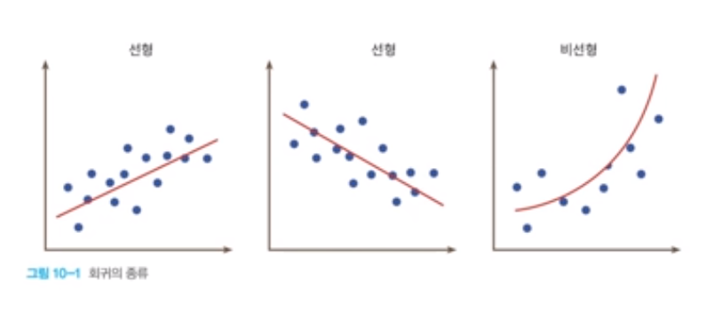

선형회귀 소개
-------------

-	직선의 방정식 f(x) = mx + b
-	선형 회귀는 입력 데이터를 가장 잘 설명하는 **기울기와 절편값**을 찾는 문제이다.

-	선형 회귀의 기본식: f(x) = Wx + b

	-	기울기 -> 가중치
	-	절편 -> 바이어스

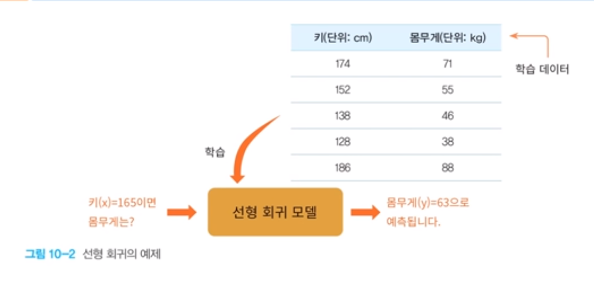

-	### 이 과정에서 기울기(w)와 절편(b)얻을 수 있다.

---

선형 회귀의 원리
----------------

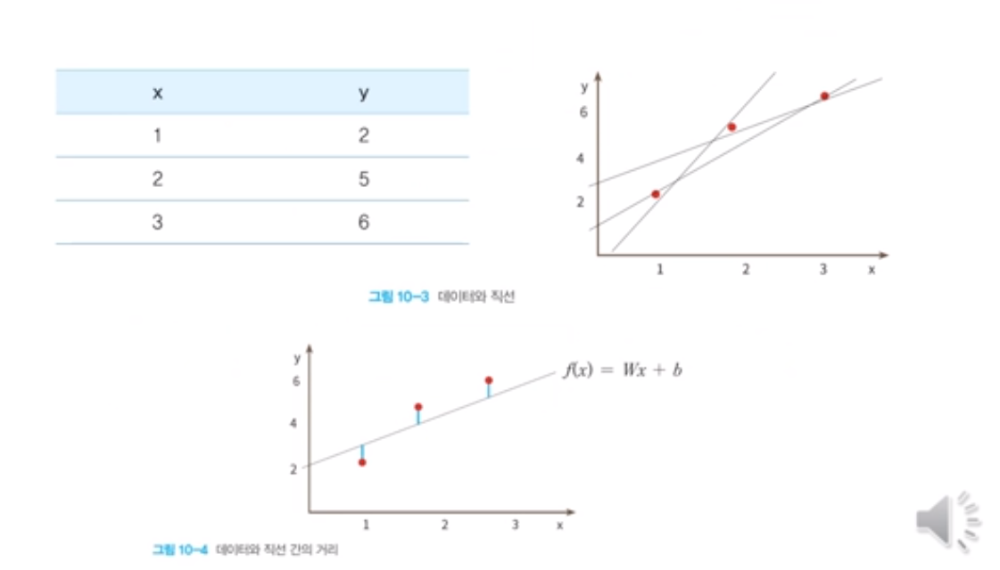

손실 함수
---------

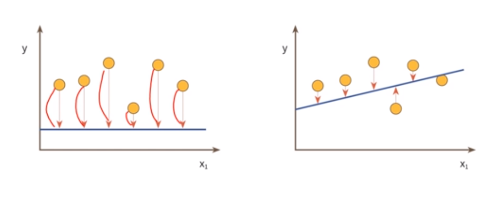

---

### 직선과 데이터 사이의 간격을 제곱하여 합한 값을 손실함수 또는 비용함수라고 한다

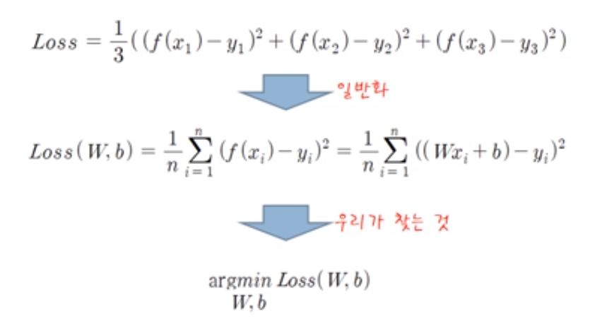

### 선형회귀에서 손실함수 최소화 방법

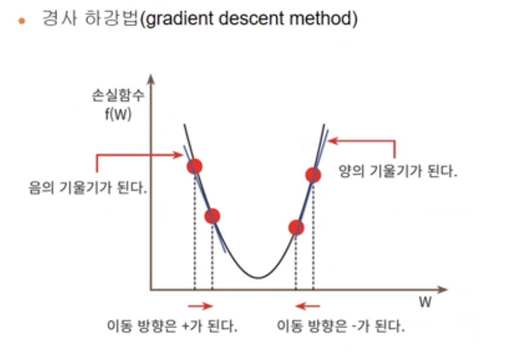

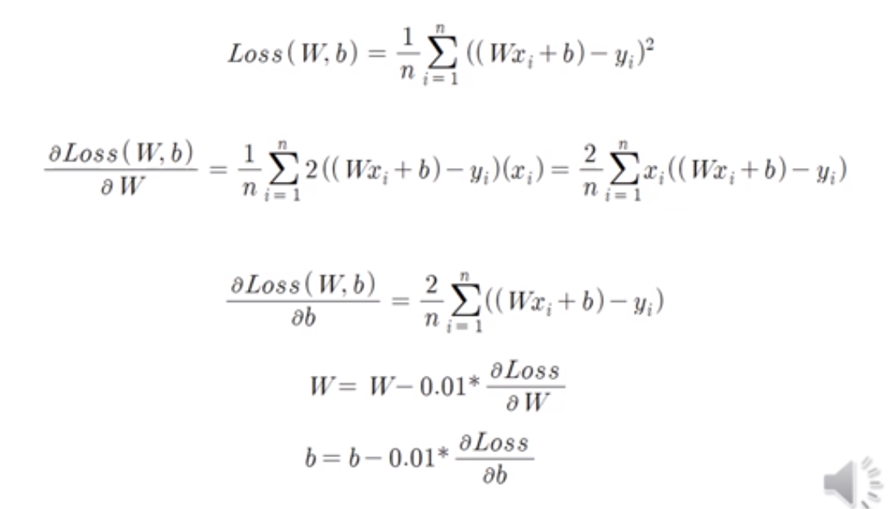

경사 하강법 구현
----------------

<pre>

<code>

import numpy as np
import matplotlib.pyplot as plt
X = np.array([0.0, 1.0, 2.0])
Y = np.array([3.0, 3.5, 5.5])

W = 0 #기울기
b = 0 #절편

lrate = 0.01 #학습률
epochs = 1000 #반복횟수

n = float(len(X)) # 입력데이터의 개수

#경사하강법
for i in range(epochs):
  y_pred = W*X + b #예측값
  dW = (2/n) * sum(X * (y_pred - y))
  db = (2/n) * sum(y_pred - y)
  W = W - lrate * dW #기울기 수정
  b = b - lrate * db #절편수정

print ( W, b)
y_pred = W*X + b

plt.scatter(X,Y)

plt.plot([min(X), max(X)], [min(y_pred)], max(y_pred)], color = 'red')
plt.show()

</code>

</pre>

선형 회귀 예제
--------------

<pre>

<code>

import matplotlib.pylab as plt
from sklearn import linear_model

#선형회귀 모델 생성
reg = linear_model.LinearRegression()

#데이터는 파이썬의 리스트로 만들어도 되며 넘파이의 배열로 만들어도 된다.
X = [[0], [1], [2]] # 2차원으로 생성해야 한다.
Y = [3, 3.5, 5.5] # y = x + 3

#학습시작
reg.fit(X,Y)

reg.coef_ #직선의 기울기 = w
reg.intercept #직선의 y절편 = b
reg.score(X,y) #얼마나 근접시켰는가 (1에 가까울수록 완벽)
reg.predict([[5]]) # 새로운 데이터로 예측 수행

# 학습 데이터와 y값을 산포도로 그린다.
plt.scatter(X,y,color = 'black')

# 학습 데이터를 입력으로 하여 예측값 계산한다.
y_pred = reg.predict(X)

# 학습 데이터와 예측값으로 선그래프로 그린다
# 계산된 기울기와 y절편을 가지는 직선이 그려진다
plt.plot(X,y_pred, color = 'blue', linewith = 3)
plt.show()

</code>

</pre>

학습 데이터 만들기
------------------

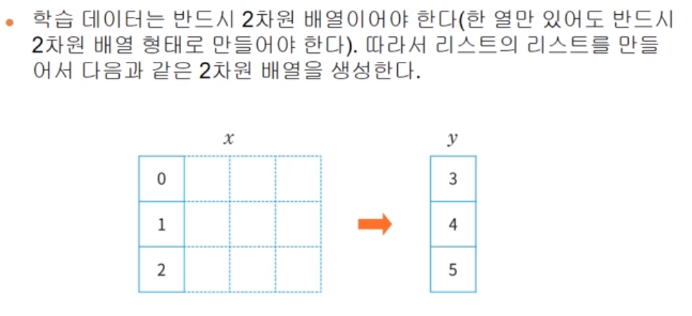

### x는 항상 2차원 배열로 만들어야한다.

과잉 적합 vs 과소 적합
----------------------

-	**과잉적합**이란 학습하는 데이터에서는 성능이 뛰어나지만 새로운 데이터에 대해서는 성능이 잘 나오지 않는 모델을 생성하는 것이다.

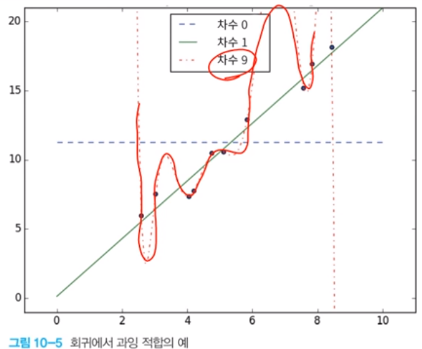

-	**과소 적합**이란 학습 데이터에서도 성능이 좋지 않은 경우이다. 이 경우에는 모델 자체가 적합하지 않은 경우가 많다. 더 나은 모델을 찾아야 한다.

---

Lab: 선형회귀 실습
------------------

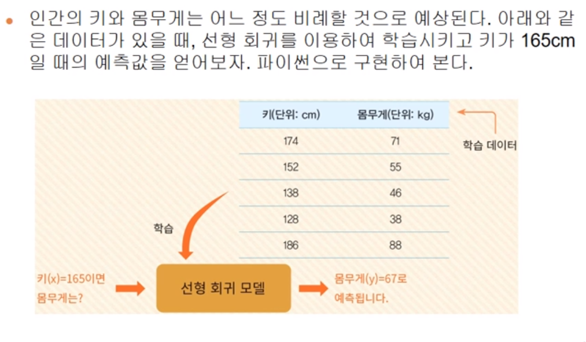

### 코드

<pre><code>

import matplotlib.pylab as plt
from sklearn import linear_model

reg = linear_model.LinearRegression()

X = \[[174],[152],[138],[128],[186]] y = [71, 55, 46, 38, 88] reg.fit(X,y) #학습

print(reg.predict(\[[165]]))

# 학습 데이터와 y 값을 산포도로 그린다.

plt.scatter(X,y, color ='black')

# 학습 데이터를 입력으로 하여 예측값을 계산한다.

y_pred = reg.predict(X)

# 학습 데이터와 예측값으로 선그래프로 그린다.
# 계산된 기울기와 y절편을 가지는 직선이 그려진다

plt.plot(X,y_pred, color = 'blue', linewidth = 3) plt.show()

</code>

</pre>

Lab: 당뇨병 예제
----------------

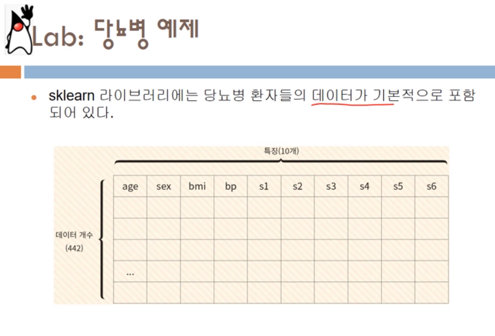

<pre>
<code>

import matplotlib.pylab as plt
import numpy as np
from sklearn.linear_model import LinearRegression
from sklearn umport datesets

# 당뇨병 데이터 세트 적재
diabetes = datesets.load_diabetes()

# 학습 데이터와 테스트 데이터를 분리한다.
from sklearn.model_slelection import train_test_split
X_train, X_test, y_train, y_test = train_test_split(diabetes.data, diabetes.target,
  test_size = 0.2, random_state = 0)

# 선형 회귀 모델로 학습을 수행한다.
model = LinearRegression()
model.fit(X_train, y_train)

# 테스트 데이터로 예측해보자
y_pred = model.predict(X_test)

#실제 데이터와 예측 데이터를 비교해보자
plt.plot(y_test, y_pred,'.')

# 직선을 그리기 위하여 완벽한 선형 데이터를 생성한다.
x = np.linspace(0,330,100)
y = x
plt.plot(x,y)
plt.show()

</code>

</pre>

Open Lab: 면적에 따른 집값 예측
-------------------------------

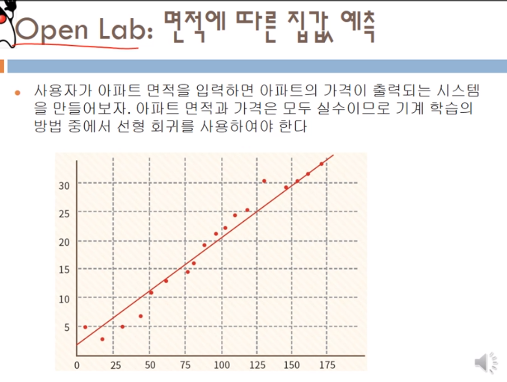

summary
-------

-	지도 학습에는 회귀와 분류가 있었다. 전자는 연속적인 값을 예측하고 후자는 입력을 어떤 카테고리중의 하나로 예측한다

-	선형 회귀는 입력 데이터를 가장 잘 설명하는 직선의 기울기와 절편값을 찾는 문제이다.

-	손실 함수란 실제 데이터와 직선 간의 차이를 제곱한 값이다.

-	손실 함수의 값이 작아지는 방향을 알려면 일반적으로 경사 하강법과 같은 방법을 많이 사용한다.
