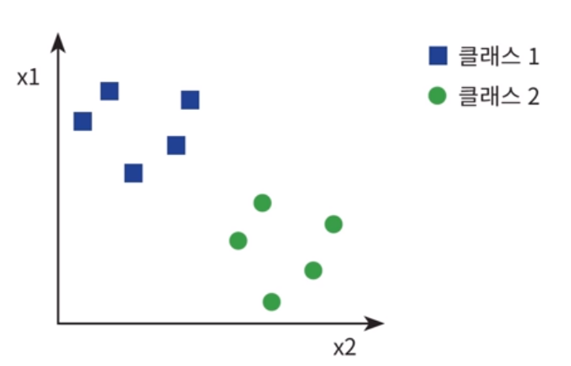
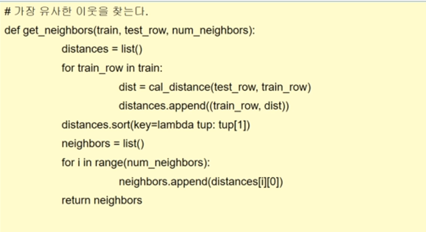
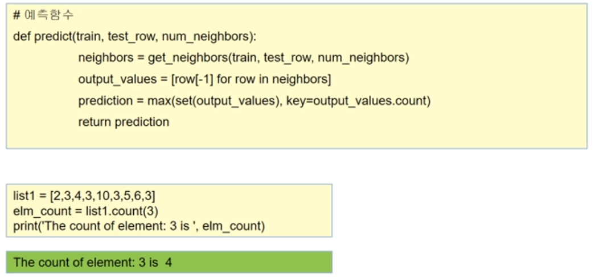

11주차
======

---

-	KNN알고리즘의 이해
-	K-means 알고리즘의 이해
-	비지도 학습을 이해 sklearn을 사용한 알고리즘의 구현

---

##KNN 알고리즘

-	모든 기계 학습 알고맂므 중에서도 가장 간단하고 이해하기 쉬운 **분류** 알고리즘
-	지도학습에 해당된다.
-	x1, x2는 특징에 해당된다.

-	새로운 데이터가 입력되어서 그래프 상에 별표로 표시되었다고 할 경우, 별표는 파란색 사각형과빨간색 원중에서 하나에 속해야 한다. 이것을 분류라고 한다.

-	k(가장 가까운 이웃)의 개수에 따라 각각의 이웃을 정렬한다.
-	가장 가까운 색의 개채가 많을 경우 그 개체의 그룹에 소속된다.

	---

	### KNN알고리즘의 장점과 단점

-	특징 공간에 있는 모든 데이터에 대한 정보가 필요하다. 왜냐하면, 가장 가까운 이웃을 찾기 위해 새로운 데이터에서 모든 기존 데이터 까지의 거리를 확이냏야 하기 때문이다. 데이터와 클래스가 많이 있다면, **많은 메모리 공간과 계산 시간**이 필요하다.

-	어떤 종류의 학습이나 준비 시간이 필요없다.(단순 거리 계산만 있어도 충분)

	---

	### sklearn을 이용한 kNN 알고리즘 실습

-	4개의 특성값에 의한 분류(꽃받침의 길이, 너비, 꽃잎의 길이와 너비) - 새로운 꽃받침과 꽃잎이 들어올 경우

<pre>
<code>

from sklearn.datasets import load_iris  #데이터셋 import
iris = load_iris()
print(iris.data)
#numpy 배열이 생성된다

print(iris.feature_names)
# 4개의  특징 이름을 출력

print(iris.target)
# 정수는 꽃의 종류를 나타냄 (0 = setosa, 1 = versicolor, 2 = virginica)
</code>
</pre>

### knn 학습

<pre>
<code>
from sklearn.model_selection import train_test_split

X = iris.data
y = iris.target

# (80:20)으로 분할한다.
X_train,X_test,y_train,y_test = train_test_split(X,y,test_size=0.2,random_state = 4)

print(X_train.shape)
print(X_test.shape)
#(120, 4)
#(30,4)의 형태라는 결과가 나타난다.

from sklearn.neighbors import KNeighborsClassifier
from sklearn import metrics

knn = KNeighborsClassifier(n_neighbors = 6)
#6개 혹은 5개로 만들어 분류개수를 지정
knn.fit(X_train, y_train)
#학습 수행

y_pred = knn.predict(X_test)
#검증(모든 행에 대해 계산하여 결과를 저장)
scores = metrics.accuray_score(y_test, y_pred)
#y_test는 정답, y_pred와의 정확도를 비교하는 accuray_score

'''
#knn 예측
knn = KNeighborsClassifier(n_neighbors = 6)
#6개 혹은 5개로 만들어 분류개수를 지정
knn.fit(X_train, y_train)
#학습 수행

#0 = setosa, 1 =  versicolor, 2 = virginica
classes = {0:'setosa', 1:'versicolor', 2:'virginica'}

#새로운 데이터의 제시
x_new = [[3,4,5,2], [5,4,2,2]]
y_predict = knn.predict(x_new)

print(classes[y_predict[0]])
print(classes[y_predict[1]])
'''
</code>
</pre>

---

비지도 학습(k-means 클러스터링)
-------------------------------

-	비지도 학습 중에서 가장 대표적인 알고리즘
-	K-means 알고리즘은 주어진 n개의 관측값을 k개의 클러스터로 분할하는 알고리즘으로, 관측값들은 거리가 최소인 클러스터로 분류된다.

**ex)**

#### 입력값

1.	k: 클러스터 수
2.	D: n개의 데이터
3.	출력값: k개의 클러스터

#### 알고리즘

1.	집합 D에서 k개의 데이터를 임의로 추출하고, 이 데이터들을 각 클러스터의 중심(centroid)으로 설정한다. (초기값 설정)

2.	집합 D의 각 데이터에 대해 k개의 클러스터 중심과의 거리를 계산하고, 각 데이터가 어느 중심점과 가장 유사도가 높은지 알아낸다. 그리고 그렇게 찾아낸 중심점으로 각 데이터들을 할당한다.

3.	클러스터의 중심점을 다시 계산한다. 즉, 2에서 재할당된 클러스터들을 기준으로 중심점을 다시 계산한다.

4.	각 데이터의 소속 클러스터가 바뀌지 않을 때까지 과정 2, 3을 반복한다.

---

#### 알고리즘을 설명하기위하여 다음과 같이 데이터들이 주어졌다고 하자. 우리는 데이터를 2개의 그룹으로 나누어야 한다. 즉 k = 2이다.

#### 알고리즘은 무작위로 2개의 중심점을 선택한다. 이것을 C1과 C2라고 하자.

#### 모든 파란색 점과 빨간색 점의 평균을 따로 계산한다.

#### 이 점이 클러스터의 새로운 중심이 된다.

#### 2개의 중심점의 위치가 변하지 않을 때까지 2단계와 3단계를 반복한다.

---

### sklearn을 이용한 K-means 클러스터링

<pre>
<code>
import matplotlib.pyplot as plt
import numpy as np
from sklearn.cluster import Kmeans

X = np.array([
    [6,3], [11, 15], [17, 12], [24, 10], [20, 25], [22, 30],
    [85, 70], [71, 81], [60, 79], [56, 52], [81, 91], [80, 81]])
# 집합의 정의
# 비지도 학습이기에 y값이 없다

plt.scatter(X[:,0],X[:,1])
# 산포도 정의  
# x[:,0]는 모든 행에 대해서 첫번째 열의 사용,
# x[:,1]는 모든 행에 대해서 두번쨰 열의 사용

Kmeans = KMeans(n_clusters = 2)
Kmeans.fit(X)

print(kmeans.cluster_centers_)

print(kmeas.labels_)
#0,1순서로 레이블이 생긴다
plt.scatter(X[:,0],X[:,1], c = kmeans.labels_, cmap='rainbow')
# 분리를 위한 그래프 설정
</code>
</pre>

---

k를 결정하는 방법
-----------------

#### "팔 꿈치" 방법 에서는 k를 1부터 증가시키면서 K-means 클러스터링을 수행한다. 각 k의 값에 대하여 SSE(sum of squared errors)의 값을 계산한다.

<pre>
<code>

var sse = [];
for (var k = 1; k <=maxK; ++k){
    sse[k] = 0;
    clusters = kmeans(dataset, k)
    clusters.forEach(function(cluster){
        mean = clusterMean(cluster);
        cluster.forEach(function(datapoint){
            sse[k] += Math.pow(datapoint - mean, 2);
        });
    })
}

</code>
</pre>

---

Lab: K-means 알고리즘 실습
--------------------------

---

##요약

---

KNN알고리즘 구현
----------------

---

### KNN의 3가지 과정

1.	유클리드 거리를 계산

2.	최근접 이웃을 찾는다

3.	예측한다.

### 1. 유클리드 거리

가장 마지막에 있는 번호가 클래스 번호(0, 1)

num_neighbors는 k와 같다.

