12주차
======

신경망(퍼셉트론)
----------------

---

### 학습 목표

-	신경망에 대해 이해한다
-	신경망의 초기 모델인 퍼셉트론을 이해한다.
-	퍼셉트론의 작동원리를 이해한다.
-	퍼셉트론의 한계점을 인식한다.

### 신경망

-	딥러닝의 시작은 1950년대부터 연구되어온 **인공신경망(artificial neural network)** 이다.

-	인공 신경망의 생물학적인 신경망에서 영감을 받아서 만들어진 컴퓨팅 구조이다.

<pre>

</pre>

### 전통적인 컴퓨터 vs 인공 신경망

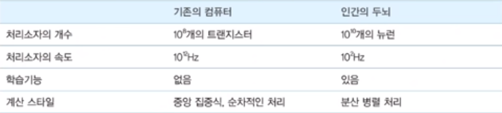

<pre>

</pre>

### 신경망의 장점

-	학습이 가능하다. 데이터만 주어지면 신경망은 예제로부터 배울 수 있다.

-	몇개의 소자가 오동작 하더라도 전체적으로는 큰 문제가 발생하지 않는다.

<pre>

</pre>

### 뉴론의 수학적인 모델

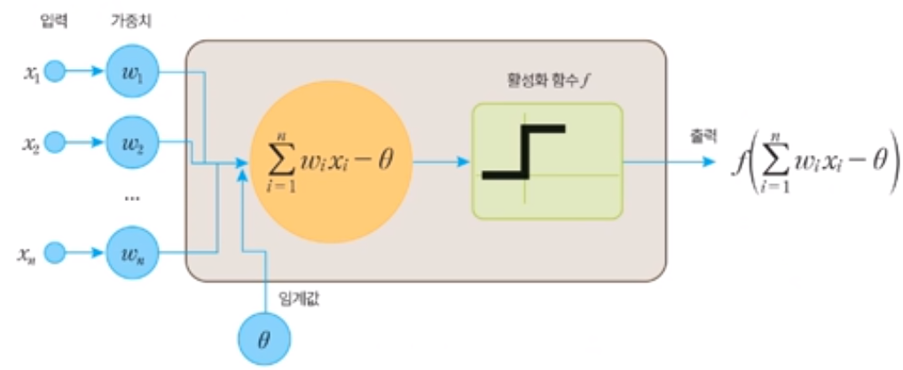

각각의 입력은 가중치를 갖고 있으며 해당 값이 임계값을 벗어나면 뉴론이 활성화된다. 임계값을 벗어난 입력값에 임계값을 차하여 0~1사이의 값으로 변환된다.

<pre>

</pre>

### 퍼셉트론

-	퍼셉트론은 1957년에 로젠블라트가 고안한 인공 신경망이다.

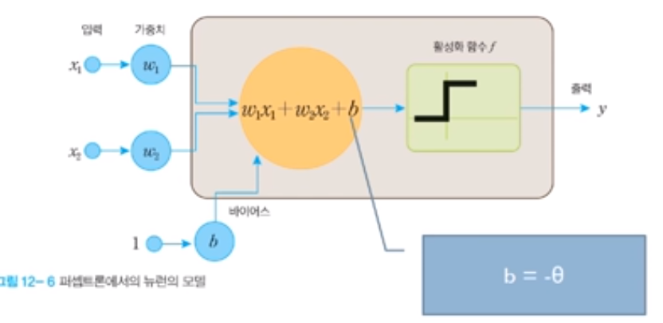

-	뉴런엣 입력신호의 가중치 합이 어떤 임계값을 넘는 경우에만 뉴런이 활성화되어 1을 출력하며 그렇지 않으면 0을 출력한다.

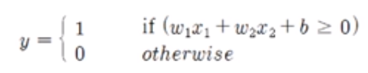

<pre>

</pre>

### 퍼셉트론의 논리연산

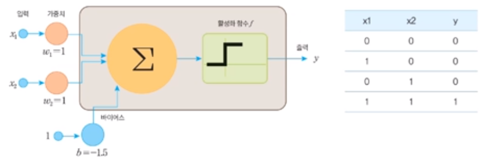

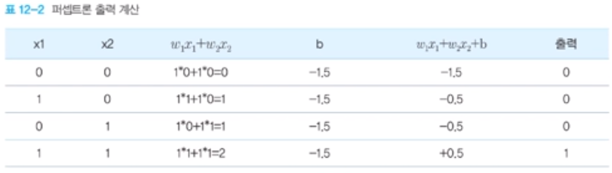

<pre>

</pre>

### 퍼셉트론의 학습 알고리즘

-	학습이라고 부르려면 신경망이 스스로 가중치를 자동으로 설정해주는 알고리즘이 필요하다.

-	퍼셉트론에서도 학습 알고리즘이 존재한다.

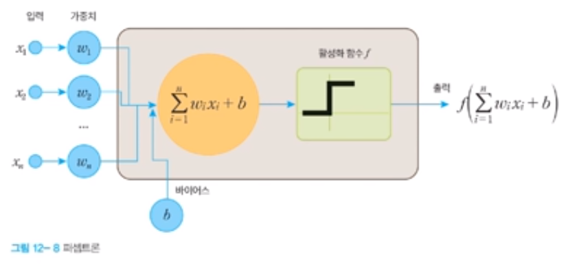

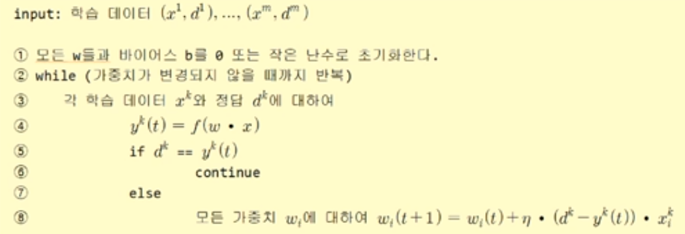

<pre>

</pre>

### 논리연산자 AND 학습과정

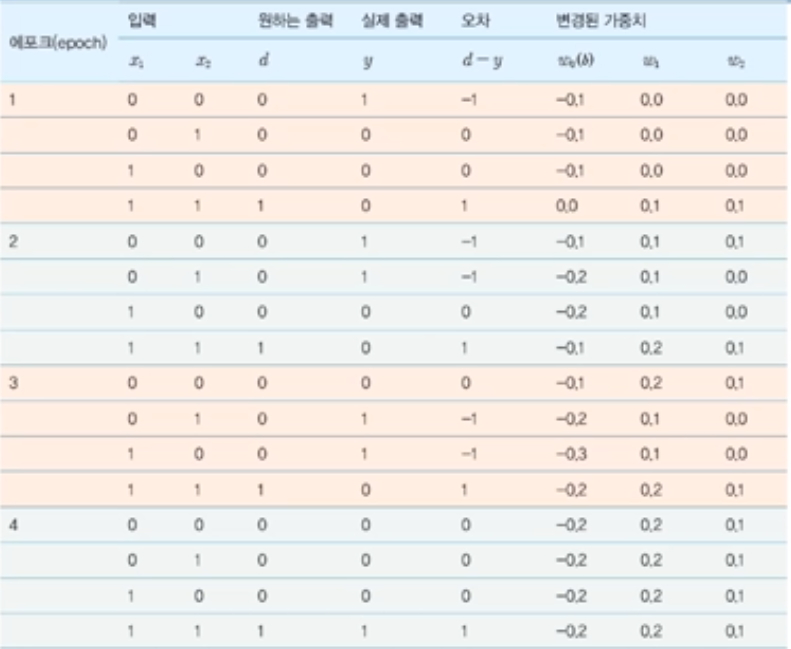

<pre>

</pre>

sklearn으로 퍼셉트론 실습하기
-----------------------------

<pre>
<code>
from sklearn.linear_model import Perceptron

# 샘플과 레이블이다.
X = [[0,0],[0,1],[1,0],[1,1]]
y = [0, 0, 0, 1]

# 퍼셉트론을 생성한다. tol은 종료 조건이다. random_state는 난수의 시드이다.
clf = Perceptron(tol = 1e-3, random_state = 0)

# 학습을 수행한다.
clf.fit(X,y)

# 테스트를 수행한다.
print(clf.predict(X))
</code>
</pre>

해당값의 출력은 [0, 0, 0, 1]이다.

<pre>

</pre>

퍼셉트론 프로그래밍
-------------------

<pre>

<code>

# 뉴론의 출력함수 계산

def calculate(input):
  global weights
  global bias
  activation = bias # 바이어스
  for i in range(2):  #입력신호 총합 계산
    activation += weights[i] * input[i] # f(WiXi + W2X2 + b)
  if activation >= 0.0: #스텝 활성화  
    return 1.0
  else:
    return 0.0

# 학습 알고리즘
def train_weights(X, y, l_rate, n_epoch):
# X는 입력, y는 출력 , l_rate는 학습률, n_epoch 반복횟수

  global weights
  global bias

  for epoch in range(n_epoch):        #에포크 만큼 반복
    sum_error = 0.0

    for row, target in zip(X, y):     #데이터셋을 반복
      actual = calculate(row)         #실제 출력 계산
      error = target - actual         #실제 출력 계산(d-y)
      bias = bias + l_rate * error
      sum_error += error**2           #오류의 제곱 계산

      for i in range(2):              # 가중치 변경
        weights[i] = weights[i] + l_rate * error * row[i]

      print(weights, bias)
    print('에포크 번호 = %d, 학습률=%.3f, 오류=%.3f' %(epoch,l_rate, sum_error))
    return weights

# 샘플과 레이블이다.
X = [[0,0],[0,1],[1,0],[1,1]]
y = [0, 0, 0, 1]

# 가중치와 바이어스 초기값
weights = [0.0, 0.0]
bias = 0.0

l_rate = 0.1
n_epoch = 5
weights = train_weights(X, y, l_rate, n_epoch)
print(weights, bias)

</code>

</pre>
-----------------------------

### 퍼셉트론의 분류
- 대학생들의 신장과 체중을 받아서 성별을 출력하는 퍼셉트론을 만들어보자

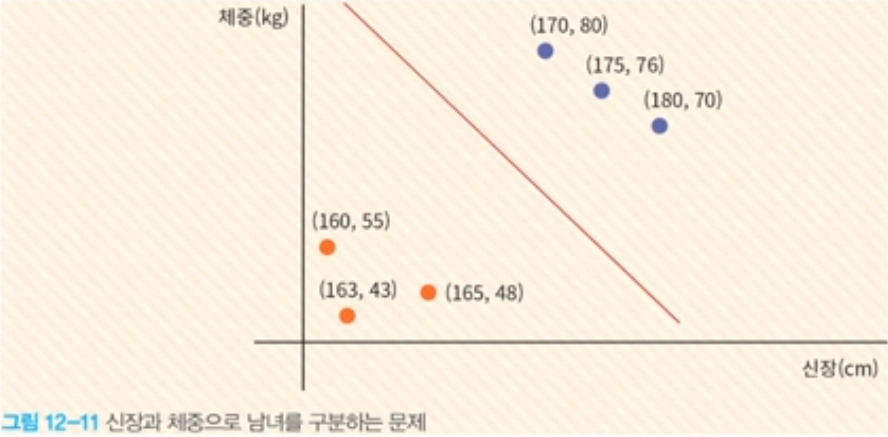

<pre>

</pre>

### 선형 분류 가능 문제
- Minsky와 Papert는 1969년에 발간된 책 "Perceptron"에서 1개의 레이어로 구성된 퍼셉트론은 XOR문제를 학습할 수 없다는 것을 수학적으로 증명
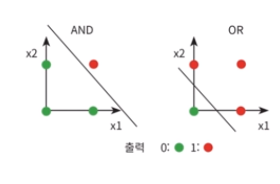
선형 분리 불가능 문제

<pre>

</pre>

### 선형 분류 가능 문제
- 패턴인식 측면에서 보면 퍼셉트론은 직선을 이요하여 입력 패턴을 분류하는
선형 분류자(linear classifier)의 일종이라고 말할 수 있다.
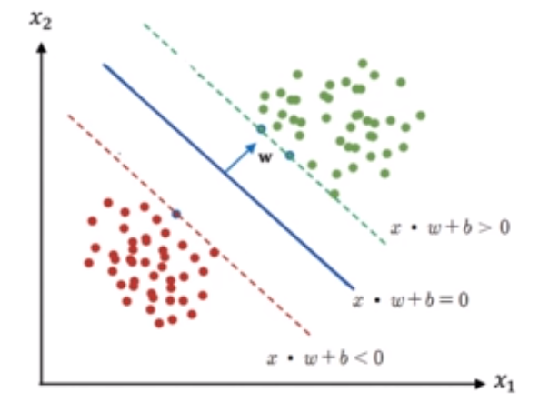

<pre>

</pre>

### 다층 퍼셉트론으로 XOR 문제를 해결
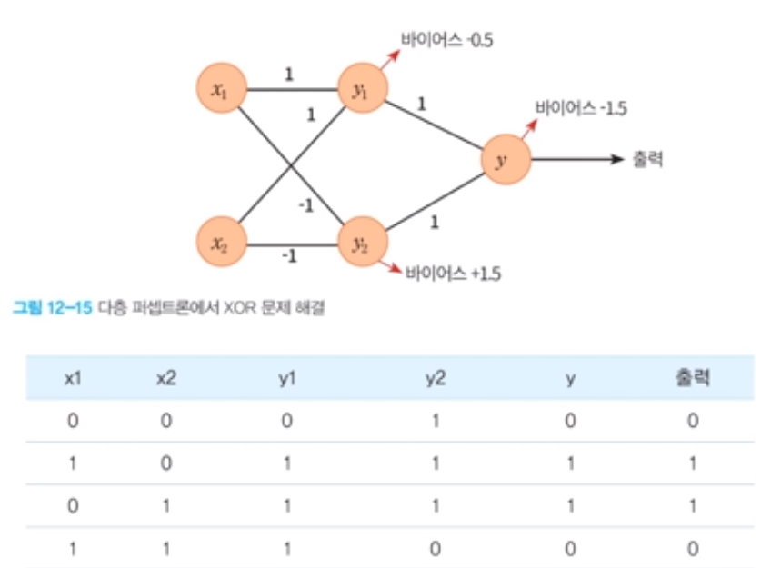

<pre>

</pre>

### 다층 퍼셉트론의 학습 알고리즘
- Minsky와 Papert는다층 퍼셉트론을 학습시키는 알고리즘을 찾기가
아주 어려울 것이라고 예언하였다.

- 1980년대 중반에 Rumelhart와 **Hinton** 등은 다층 퍼셉트론을 위한
학습 알고리즘을 재발견하게 된다.

<pre>

</pre>

## 요약

- 딥러닝의  시작은 1950년대부터 연구되어 온 인공신경망이다.

- 신경망의 가장 큰 장점은 학습이 가능하다는 점이다. 데이터만 주어지면 신경망은 예제로부터 배울 수 있다.

- 뉴론은 다른 뉴론들로부터 신호를 받아서 모두 합한 후에 비선형 함수를 적용하여 출력을 계산한다. 연결선은 가중치를 가지고 있고 이 가중치에 학습의
결과가 저장된다.

- 퍼셉트론은 하나의 뉴론만을 사용한다. 다수의 입력을 받아서
하나의 신호를 출력하는 장치이다.

- 퍼셉트론은 AND나 OR같은 논리적인 연산을 학습할 수 있었지만
XOR 연산은 학습할 수 없었다. 선형 분리 가능한 문제만 학습할 수 있었다.
