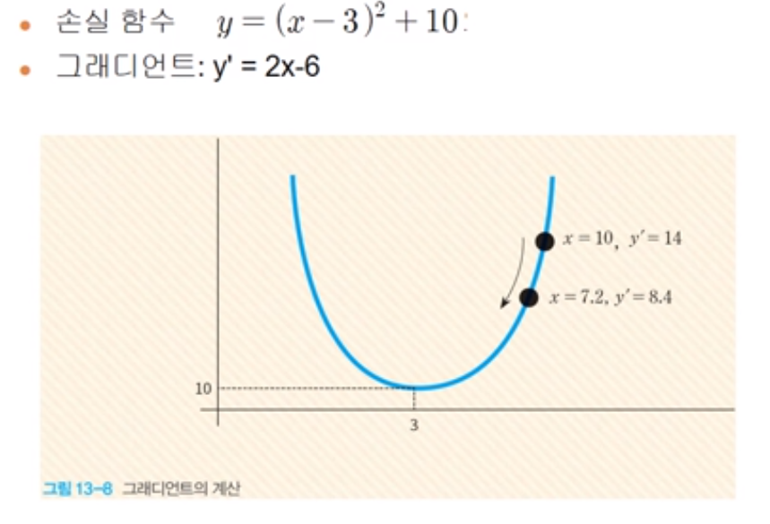
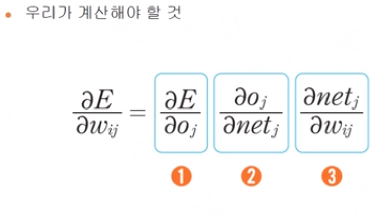
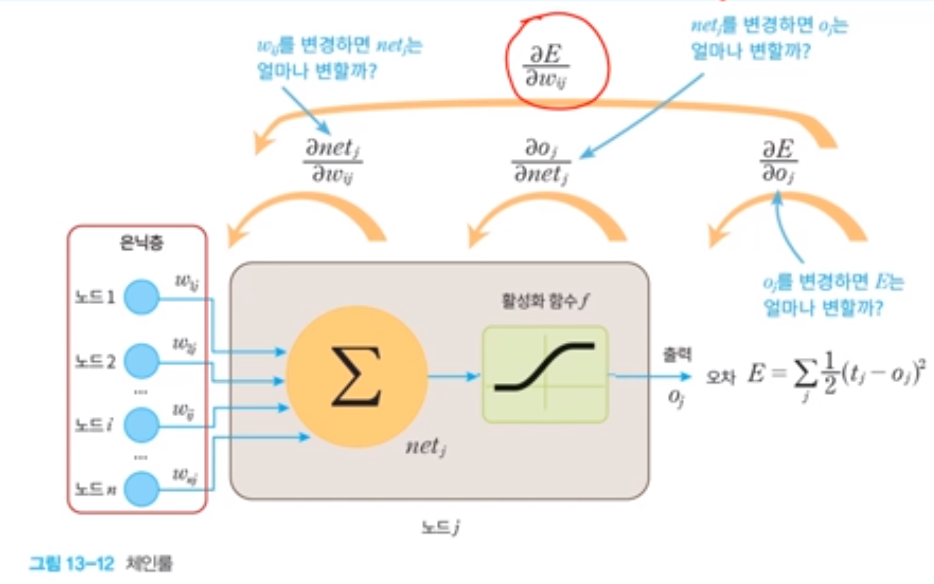
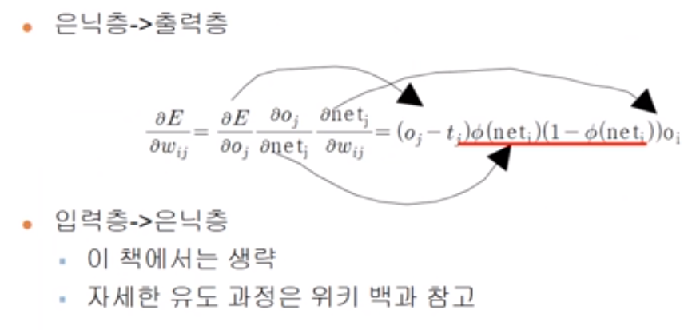
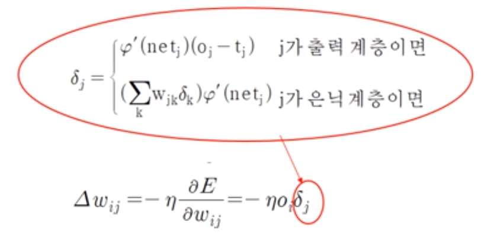
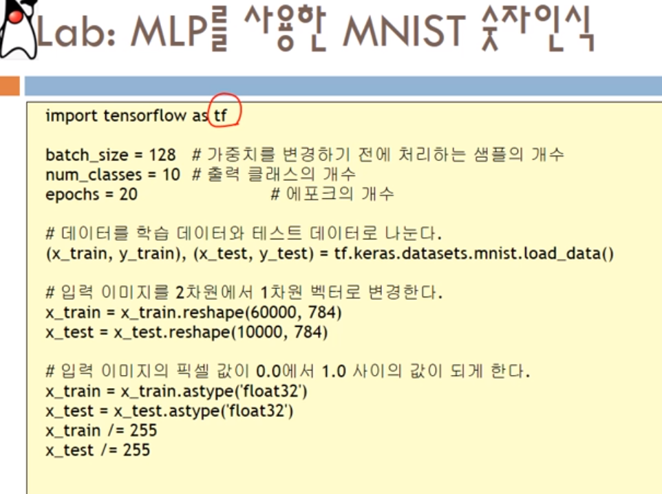
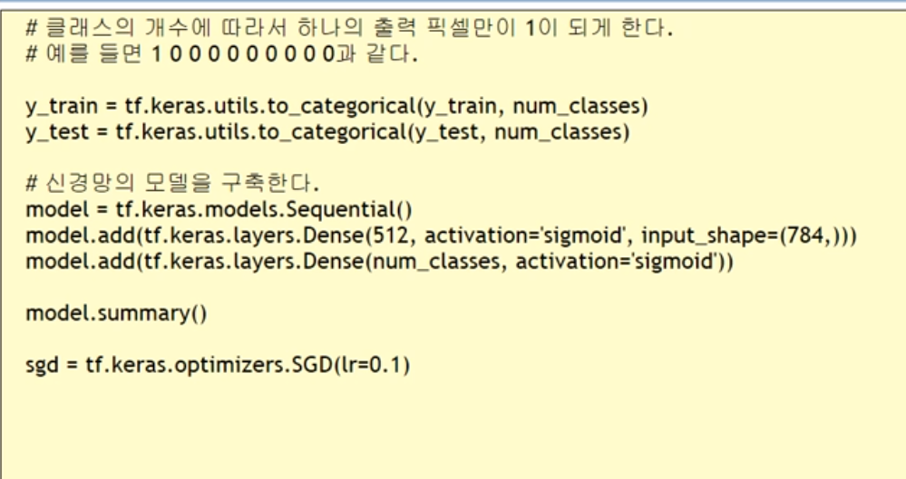

# 인공지능 13주차

## MLP
- 다층 퍼셉트론으로 입력층과 출력층 사이에 은닉층(hidden layer)을 가지고 있는 신경망

## 역전파 알고리즘

- 역전파 알고리즘은 입력이 주어지면 순방향으로 계산하여 출력을 계산한 후에 실제 출력과 우리가 원하는 출력 간의 오차를 계산한다.

- 이 오차를 역방향으로 전파하면서 오차를 줄이는 방향으로 가중치를 변경한다.

## 활성화 함수

- 퍼셉트론에서는 계단 함수(step function)를 활성화 함수로 사용하였지만, MLP에서는 다양한 비선형 함수들을 활성화 함수로 사용한다.

- Sigmoid, TanH, ReLU 세가지가 대표적인 활성화 함수이다.(ReLU가 가장 성능이 좋다)

## 역전파 학습 알고리즘

- 순방향 출력 계산

<pre>
</code>
current = input
  for each layer in network:
    for each neuron i in layer:
      net = get_sum(weight[i], current) # 입력의 가중 합을 계산
      output[i] = activation_func(net)  # 각 노드들의 출력을 계산한다.
    current = output  # 다음 계층은 현재 계층의 출력을 입력을 사용한다
</code>
</pre>

## 손실 함수(Mean Square Error)

- 전체 오차는 목표 출력값에서 실제 출력값을 빼서 제곱한 값을 모든 출력 노드에 대하여 합한 값이다.

## 경사 하강법

- 현재 위치에서 함수의 그래디언트 값( 접선의 기울기, 1차 미분값 )을 계산한 후에 그래디언트의 반대 방향으로 움직이는 방법이다.

## 경사 하강법의 실습

## 경사 하강법 프로그래밍

<pre>
<code>

x = 10
learning_rate = 0.01
precision - 0.00001
mat_iterations = 1000px
# 손실 함수를 람다식으로 정의한다.
loss_func = lambda x: (x-3)**2 + 10

# 그래디언트를 람다식으로 정의한다. 손실 함수의 1차 미분값이다.
gradient = lambda x: 2*x-6

# 그래디언트 하강법
for i in range(mat_iterations):
    x = x - learning_rate * gradient(x)
    print("손실 함수값(",x,")=", loss_func(x))
print("최소값 = ", x)

</code>
<pre>

## 역전파 알고리즘의 설명

### 체인 룰을 사용한 3단분리

## 가중치 변경 수식

## 결론

## 역전파 알고리즘 의사 코드
- 신경망의 가중치를 작은 난수로 초기화 한다
- do 각 훈련 샘플 sample에 대하여 다음을 반복한다.
  - actual = calculate_network(sample) //순방향 패스
  - target = desired_output(sample)
  - 각 출력 노드에서 오차(target-actual)을 계산한다.
  - 은닉충에서 출력층으로의 가중치 변경값을 계산한다. // 역방향 패스
  - 입력층에서 은닉층으로의 가중치 변경값을 계산한다. // 역방향 패스
  - 전체 가중치를 업데이트 한다.
- until 모든 샘플이 올바르게 분류될 때까지

## 넘파이를 이용하여 MLP 구현

- 넘파이의 기능을 이용하면 모든 것을 행렬과 벡터로 표시할 수 있다.
- 행렬을 이용하면 동시에 여러개 의 예제를 동시에 학습시킬수 있다.
- 역전파할 때는 가중치 행렬을 전치시켜서 사용한다.
- 바이어스는 입력을 1.0으로 고정하고, 이 입력에 붙은 가중치로 생각한다.

## 소스

pre>
<code>

import numpy as np

#시그모이드 함수
def actf(x):
  return 1/(1+np.exp(-x))
# 시그모이드 함수의 미분값
def actf_deriv(x):
  return X*(1-x)

# XOR 연산을 위한 4행*2열의 입력 행렬
# 마지막 열은 바이어스를 나타낸다.
X = np.array([[0,0,1],[0,1,1],[1,0,1],[1,1,1]])

# XOR 연산을 위한 4행*1열의 목표 행렬
y = np.array([[0],[1],[1],[0]])

#2차원 행렬이여야먄 가능하다.(전치행렬과 역전파의 관계)

np.random.seed(5)

input = 3 #입력층의 노드개수, 2개이지만 바이어스를 위해 한개를 더 추가한다.
hiddens = 6 #은닉층의 노드개수, 5개이지만 바이어스를 위해 한개를 더 추가한다.
outputs = 1 # 출력층의 노드 개수, 출력은 언제나 한개이다

#가중치를 -1.0에서 1.0 사이의 난수로 초기화한다.
weight0 = 2*np.random.random((inputs, hiddens)))-1
weight1 = 2*np.random.random((inputs, outputs)))-1

#반복한다.
for i in range(10000):

  # 순방향 계산
  layer0 = X  #입력을 laer0에 대입한다.
  net1 = np.dot(layer0, weight0 # 행렬의 곱을 계산한다, dot은 곱셈함수(x*w)
  layer1 = actf(net1) # 활성화 함수를 적용한다.
  layer[:,-1] = 1.0 # 마지막 열은 바이어스를 나타낸다. 1.0으로 만든다.
  net2 = np.dot(layer1, weight1) # 행렬의 곱을 계산한다.
  layer2 = actf(net2) # 활성화 함수를 적용한다.

  #출력층에서의 오차를 계산한다.
  layer2_error = layer2-y

  #출력층에서의 델타값을 계산한다.
  layer2_delta = layer2_error*actf_deriv(layer2)

  #은닉층에서의 오차를 계산한다.
  #여기서 T는 행렬의 전치를 의미한다.
  #역방향으로 오차를 전파할 때는 반대방향이므로 행렬이 전치되어야 한다.
  layer1_error = np.dot(layer2_delta, weight1.T)

  #은닉층에서의 델타를 게산한다.
  layer1_delta = layer1_error*actf_deriv(layer1)

  #은닉층 -> 출력층을 연결하는 가중치를 수정한다.
  weight1 += -0.2*np.dot(layer1.T, layer2_delta)

  #입력층 -> 은닉층을 연결하는 가중치를 수정한다.
  weight0 += -0.2*np.dot(layer0.T, layer1_delta)

print(layer2)

</code>
<pre>

## keras모델 작성

<pre>
<code>
from tf.Keras.models import Sequential # 순방향 신경망 제작 시 사용

model = Sequential() # 객체 생성

from tf.Keras.layers import Dense # 각 레이어간 빠짐없이 연결시키는 것

model.add(Dense(units = 64, activation = 'sigmoid', input_dim = 100)) # 64개의 뉴런, 활성화 함수는 시그모이드,  입력은 100개
model.add(Dense(units = 10, activation='sigmoid')) # 64개의 뉴런, 활성화 함수는 시그모이드
#두개의 레이어가 붙음

#학습과정 정의

model.compile(loss = 'mse',
        optimizer = 'sgd'
        metrics=['accuracy']) #학습
model.fit(X,y,epoch=5,batch_size = 32) # X,y 는 입력 epochs는 반복 횟수, batch_size는 한번에 학습시키는 예제의 개수(잔여 레이어)

loss_and_metrics = model.evaluate(X,y,batch_size = 128) #학습 정보 저장
classes = model.predict(new_X, batch_size=128) # 새로운 예측 정보 추출

</code>
</pre>

## keras모델 작성(XOR)

<pre>
<code>
import tensorflow as tf
import numpy as np

X = np.array([0,0], [0,1], [1,0], [1,1])
y = np.array([0],[1],[1],[0])

model = tf.keras.models.Sequential()
model.add(tf.keras.layers.Dense(2, input_dim = 2, activation = 'sigmoid'))
model.add(tf.keras.layers.Dense(1, activation = 'sigmoid'))

sgd = tf.keras.optimizer.SGD(lr = 0.1)
model.compile(loss = 'mean_squared_error', optimizer = sgd)

model.fit(X, y, batch_size = 1, epochs = 1000)
print(model.predict(X))
</code>
</pre>

## 요약

- 입력층과 출력층 사이에 은닉층을 가지고 있는 신경망을 다층 퍼셉트론이라고 한다.
- 다층 퍼셉트론을 학습시키기 위하여 역전파 알고리즘이 재발견 되었으며 이 알고리즘이 지금까지도 신경망 학습 알고리즘의 근간이 되고 있다.
- 역전파 알고리즘은 입력이 주어지면 순방향으로 계산하여 출력을 계산한 후에 실제 출력과 우리가 원하는 출력 간의 오차를 계산한다. 이 옿차를 역방향으로 전파하면서 오차를 줄이는 방향으로 가중치를 변경한다.
