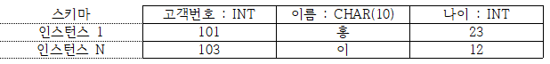

#1장

##데이터 & 정보
---------------

### 데이터

-	현실세계에서 수집, 측정한 값과 사실

###정보 - 데이터를 가공한 결과물이며 의사결정에 있어 유용하다.

### 정보처리

-	데이터를 가공하여 정보를 추출하는 일련의 과정

### 정보시스템

-	데이터를 수집하여 저장해 두었다가 필요 시 유용한 정보를 만들어주는 수단

	### 데이터베이스

-	여러 사용자가 **공유**하여 사용 가능하도록 **통합**해서 **저장**한 **운영**데이터 집합

-	최소한의 중복을 허용하는 통합데이터

-	컴퓨터가 접근가능한 매체에 저장되는 저장데이터

-	조직의 여러 사용자가 동시에 사용할 수 있도록 하는 공유데이터

-	조직의 중요 기능을 지속가능케 하기 운영데이터

### 데이터베이스의 주요 기능

1.	실시간 접근, 정확한 데이터 유지를 위한 계속 변화
2.	주소, 위치가 아닌 내용기반 참조
3.	동시 공유 및 사용

### 데이터베이스 관리 시스템

-	사용자가 데이터 베이스 내의 데이터를 접근할 수 있도록 하는 SW도구 # # #2장

파일 시스템 & DBMS
------------------

---

### 파일시스템의 단점

-	데이터 종속성, 데이터 중복성 (데이터 무결성 유지 어려움)

### 데이터베이스관리 시스템(DBMS)

-	조직에 필요한 데이터를 DB에 통합하여 저장 및 관리
	-	정의기능: DB구조 정의, 수정가능
	-	조작기능: 데이터 삽입, 삭제, 수정, 검색 연산
	-	제어기능: 정확, 안전하 데이터

### DBMS 발전 과정

-	1세대
	-	네트워크 DBMS: 그래프
	-	계층 DBMS: 트리
-	2세대
	-	관계 DBMS: 테이블 형태
-	3세대
	-	객체지향 DBMS: 객체 사용
	-	객체관계 DBMS: 객체 + 관계

**주요 인물*** 계층 DB제안: 바흐만* 관계 DB의 창시자: 코드* 개체-관계 모델링 발안자: 피터 첸* 오라클: 밥 마이너* 가르치는 사람: 이해각

#3장

##데이터베이스 시스템
---------------------

### 데이터베이스 시스템(DBS)

-	데이터베이스에 데이터 저장 및 관리, 조직에 필요한 정보를 생성
	1.	DBMS
	2.	사용자
	3.	DB
	4.	데이터 언어
	5.	컴퓨터

### 스키마

-	지식의 추상적 구조, DB에 저장되는 데이터 구조와 제약조건 정의

### 인스턴스

-	스키마에 따라 DB에 저장된 값 
