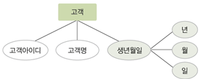

4장
===

데이터 모델
-----------

---

### 1. 데이터 모델링

-	현실세계의 데이터를 DB 옮겨오는것
	-	개념적 데이터 모델링: 현실 -> 개념 = 개념적 데이터모델 ex)개체-관계 모델
	-	논리적 데이터 모델링: 개념 -> DB = 논리적 데이터 모델 ex) 관계 데이터 모델

### 2. 데이터 모델

-	데이터 모델링 결과물

	-	연산, 제약조건, 데이터 구조

		### 3. 개체 - 관계 모델(E-R모델)

-	개체-개체간의 관계를 이용해 현실세계를 개념적 구조로 표현

	-	개체, 속성, 관계 이세가지 요소가 가장 중요하다.
	-	E-R 다이어그램은 이를 그림으로 표현한 것 

### 4. 개체(Entity)

-	저장 가치가 있는 사물, 사람, 개념으로 레코드에 해당된다.

### 5. 속성(Attribute)

-	개체나 관계가 가진 고유 특성, 데이터의 가장 작은 논리적 단위로 필드에 해당된다. 

### 6.속성 분류(1)

-	단일값 속성
	-	하나의 값만 가짐
-	다중값 속성
	-	값을 여러개 가짐 ex) 연락처
-	단순 속성
	-	의미를 더는 분해 불가능한 상태
-	복합 속성
	-	의미를 분해 가능한 상태 ex) 주소 = 도, 시, 동

#### 예시

 

### 7. 속성 분류(2)

-	널 속성
	-	NULL 값을 허용
-	키속성
	-	각 개체 인스턴스를 식별하는데 사용되는 속성(고유하며 표시할 시 밑줄을 표시)

### 8. 관계

-	개체와 개체가 맺고있는 연관성(매핑)
	-	관계 분류
	-	이항 관계 - 개체타입 2개간의 관계
	-	삼항 관계 - 개체타입 3개간의 관계
	-	순환 관계 - 개체타입 하나가 자기자신과 관계 

### 9. 매핑 카디널리티

-	관계를 맺는 두 집합에서, 각 개체 인스턴스가 연관성을 맺고있는 상대 개체 집합 인스턴스의 개수

-	유형

	-	일대일 관계
	-	일대다 관계
	-	다대일 관계  

-	참여 특성

	-	필수적 참여(이중선)
	-	선택적 참여 - 일부 참여 허용

### 10. 관계의 종속성

-	약한 개체: 다른개체 존재 여부에 의존적
-	오너개체 : 다른 개체의 존재여부 결정(서로 일대다 관계, 약한개체는 필수적 참여)

 

-	관계 데이터 모델
	-	dB 논리적 구조 2차원 테이블 형태 #
-	계층 데이터 모델

	-	트리형태, 개체간 상하관계 성립
	-	부모 vs 자식 = 일대다, 다대다 관계 직접 표현 불가능
	-	두 개체 사이에 하나의 관계만 정의 가능
	-	구조가 복잡해질 수 있고 삽입, 삭제, 수정, 검색 어려움 #

-	네트워크 데이터모델

	-	개체간에 일대다 관계만 가능
	-	다대다 직접 표현 불가능

5장
===

관계데이터 모델
---------------

---

### 1.릴레이션

-	한 개체에 대한 데이터
	-	테이블 구조
-	속성
	-	릴레이션 열
-	튜플

	-	릴레이션 행  

-	도메인

	-	속성 타입(INT, CHAR(10)...)

-	차수

	-	하나의 릴레이션에서 속성 전체의 개수

-	카디널리티

	-	하나의 릴레이션에서 투플 전체의 개수

-	릴레이션 스키마

	-	릴레이션의 논리적 구조, 정적이다

-	릴레이션 인스턴스

	-	튜플 집합, 동적이다.

-	데이터베이스 스키마

	-	데이터베이스를 구성하는 릴레이션 스키마 모음

-	데이터베이스 인스턴스

	-	데이터베이스를 구성하는 릴레이션 인스턴스 모음

\#

### 2.릴레이션의 특징

-	튜플의 유일성, 튜플의 무순서, 속성의 무순서, 속성의 원자성

###3. 키 - 릴레이션에서 튜프들을 유일하게 구별하는 속성, 속성의 집합

-	유일성, 최소성(최소한의 속성들로만 키 구성)

-	키의 종류

	-	슈퍼키: 유일성을 만족하는 속성 또는 속성집합
	-	후보키: 유일성 및 최소성을 만족하는 키
	-	**기본키**: 후보키 중 기본적로 사용하기 위해 선택된 키
	-	대체키: 기본키로 선택되지 못한 후보키
	-	**외래키**: 다른 릴레이션의 기본키를 참조한 키
		-	참조하는 릴레이션: 외래키를 가진 릴레이션
		-	참조되는 릴레이션: 외래키가 참조하는 기본키를 가진 릴레이션 (이름은 다르되 도메인은 같아야 한다) (참조하는 릴레이션은 외래키를 기본키로 사용 가능하고 NULL값을 가질 수 있다)

###4. 개체 무결성 제약조건

-	기본키를 구성하는 모든 속성은 NULL값을 가질 수 없음

###5. 참조 무결성 제약조건

-	외래키는 참조할수 없는값을 가질 수없음.
